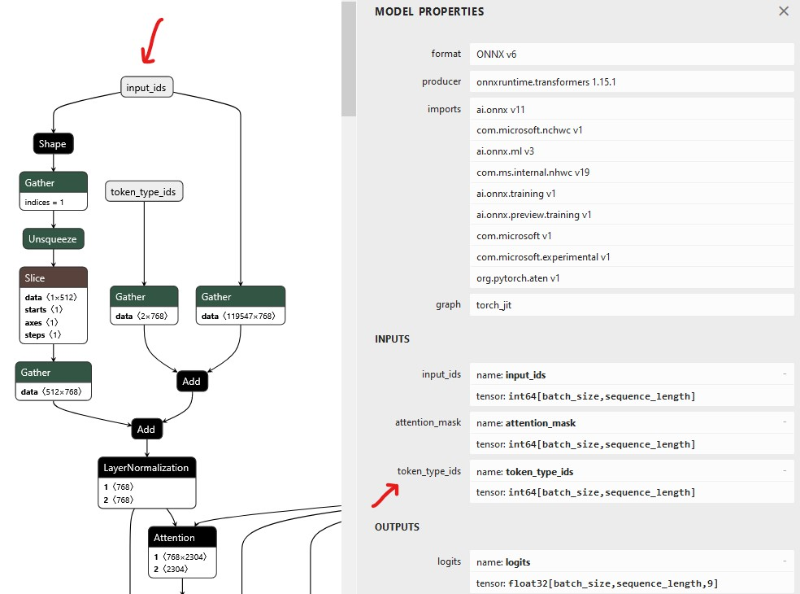

# Named Entity Recognition (NER)

This sample shows how to use a BERT/DistilBERT based ONNX model for Token Classification / NER in [ML.NET](https://dotnet.microsoft.com/en-us/apps/machinelearning-ai/ml-dotnet).

## Export a model to ONNX

To export a Hugging Face model to ONNX you can follow the [instructions](https://huggingface.co/docs/optimum/exporters/onnx/usage_guides/export_a_model#exporting-a-model-to-onnx-using-the-cli) 
provided by Hugging Face or:

Install Python

run these scripts: 


```shell
pip install optimum[exporters]

pip install accelerate
```

and finally use the CLI tool `optimum-cli` to export the model:

```shell
optimum-cli export onnx --model dslim/bert-base-NER bert-base-NER/
```

or 
```shell
optimum-cli export onnx --model dmargutierrez/distilbert-base-multilingual-cased-mapa_coarse-ner/
```

according to the model you want to use.

For my tests I have used a multilingual cased model found [here](https://huggingface.co/dmargutierrez/distilbert-base-multilingual-cased-mapa_coarse-ner).

This model does not have *token type ids*, hence the configuration sets `HasTokenTypeIds` to *false* :

```c#
var configuration = new Configuration(modelPath, numberOfTokens: 5)
{
    HasTokenTypeIds = false
};
```

You can use [Netron](https://netron.app/) to check the shape of the input/output of your ONNX model.  
Once provided your model, select the `input_ids` node on the pane, and check the model properties.



If your model has `token_type_ids` defined, simply set the configuration property to true.

The folder where the ONNX model is exported should contain a bunch of files.
To run this example we need the configuration file `config.json` and the vocabulary `vocab.txt`.

The console should show the result on the NER process:

```
 Wolfgang=B-PERSON
 Mu¨ller=I-PERSON
 Berlin=B-ADDRESS
 ,=I-ADDRESS
 Germany=I-ADDRESS
```
Where each word identified is associated to one of the tokens supported by the model.

```
B- indicates the beginning of an entity.
I- indicates a token is contained inside the same entity.
```

If you want to find out more about the meaning of the tokens, Hugging Face is a good source of [information](https://huggingface.co/learn/nlp-course/chapter7/2?fw=pt).

Different models might have differnt labels. 
The configuration file `config.json` found in the folder where the models is downloaded will give you some information on the supported labels and their names:

```json
"id2label": {
    "0": "O",
    "1": "B-ORGANISATION",
    "2": "I-ORGANISATION",
    "3": "B-ADDRESS",
    "4": "I-ADDRESS",
    "5": "B-DATE",
    "6": "I-DATE",
    "7": "B-PERSON",
    "8": "I-PERSON",
    "9": "B-AMOUNT",
    "10": "I-AMOUNT",
    "11": "B-TIME",
    "12": "I-TIME"
  },
```

I have used a Bert Tokenizer found in this [repo](https://github.com/georg-jung/FastBertTokenizer).
